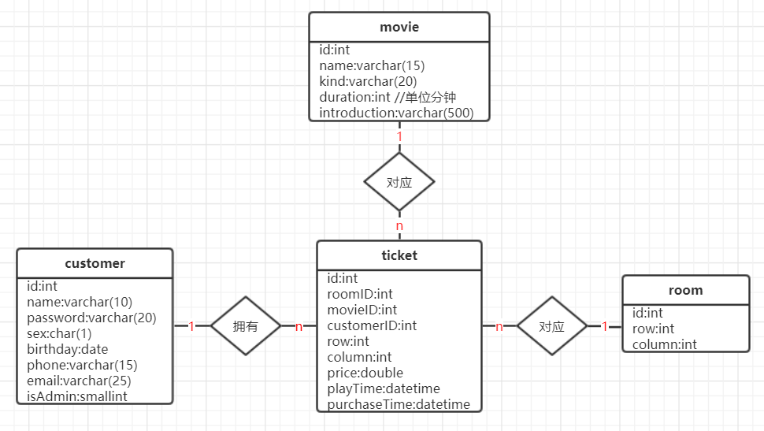

# 电影院的座位管理系统
## 介绍
一次普通的课程设计，目前数据库文件丢失。
## 题目
* 实现影院客户基本信息的管理；
* 实现影院上映影片档期的管理；
* 实现影院影厅放映影片的管理；
* 实现售票，现金流和座次号的管理；
* 统计影院的日，月和季度收入；
* 统计影片的收入。
## 数据库表结构

## 使用语言、框架
* 前端：html、css、javascript、layui、jquery
* 后端：java、spring、spring mvc、mybatis
## 开发环境
* jdk 8
* eclipse